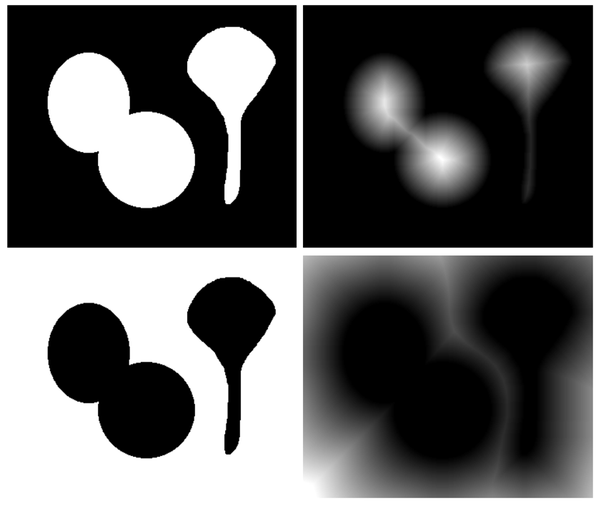

<h2 >Nhận diện vật thể là màu</h2>

- 
Dùng trackbar để thu thập ngưỡng màu 

- Đối với tùy trường hợp như nhận diện vật thể :

    + Có thể dựa vào hình dáng, kích cỡ để chọn lọc

    + Xử lý nhiễu và giảm mọi thứ về nhỏ nhất sau đó làm dày, giản nở nó lên, dùng:
    
        + kernel = np.ones((5, 5), np.uint8)

        + mask_e = cv2.erode(mask, kernel, iterations=1)  # Xói mòn
    
        + mask_dit = cv2.dilate(mask_e, kernel, iterations=2)  # Giản nở

        + Cuối cùng dùng contourArea

---

<h2> Thuật toán watershed Algorithm </h2>

Xử lý cạnh và segment

+ kernel = np.ones((5, 5), np.uint8)

<h4>Euclidean Distance Transform (EDT) </h4>

Là một phương pháp trong xử lý ảnh dùng để tính toán khoảng cách Euclidean từ mỗi điểm trong một ảnh nhị phân (binary image) đến điểm gần nhất thuộc một tập hợp các điểm xác định 

cv2.distanceTransform(binary_image, cv2.DIST_L2, 5)

Cuối dùng cv2.watershed để phân đoạn vật thể

